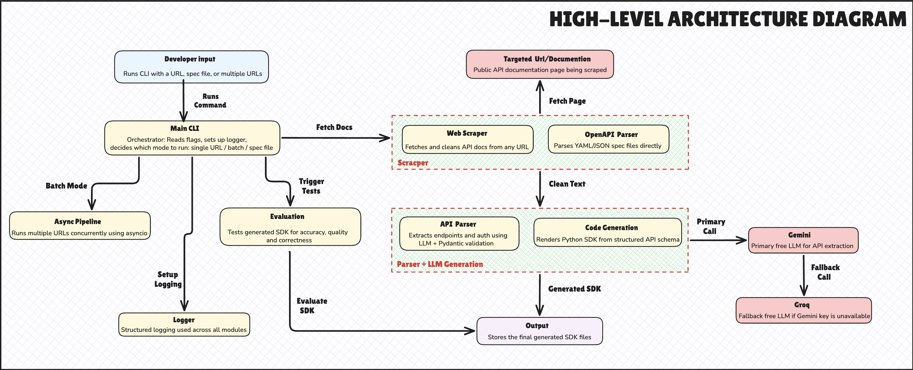

# Smart API Tool – Auto-generated Python SDK from API docs

Smart API Tool is an autonomous, production-ready pipeline that dynamically converts static REST API documentation into fully functioning, PEP-8 compliant Python SDKs using LLM parsing, Pydantic validation, and deterministic Jinja2 code generation.

## Architecture



The tool processes documentation through a 5-tier pipeline:
1. **Scraping**: Fetches static HTML or renders JavaScript-heavy sites via Playwright, respecting `robots.txt`.
2. **LLM Parsing**: Gemini/Groq extracts API endpoints, HTTP methods, and parameters using strict Few-Shot prompts.
3. **Validation**: Pydantic strictly enforces the `APISchema` structure, eliminating hallucinations.
4. **Code Generation**: A deterministic Jinja2 template maps the schema into a robust Python class.
5. **Quality Assurance**: `autoflake` and `black` auto-format the code, ensuring 0 Code Quality issues.

## Setup

```bash
git clone https://github.com/Prathamesh07-stack/smart-api-tool.git
cd smart-api-tool

# Create and activate virtual environment
python -m venv .venv
source .venv/bin/activate  # Windows: .venv\Scripts\activate

# Install dependencies
pip install -r requirements.txt
```

*(Ensure you have your `.env` file populated with `GEMINI_API_KEY` and `GROQ_API_KEY`)*

## Running the tool locally

### Single URL (JSONPlaceholder)
```bash
python main.py \
  --url https://jsonplaceholder.typicode.com/ \
  --playwright \
  --evaluate \
  --smoke-test \
  --log-level INFO
```
**Expected Output**:
- Logs for checking `robots.txt`, Scraping, and Parsing.
- SDK saved to `output/jsonplaceholder_api_sdk.py`.
- Full Latency Tracker report.
- Evaluation metrics (Precision, Recall, F1) if a ground truth file exists, or a friendly skip message.
- Smoke test auto-discovers and fires the first 2 safe GET endpoints.

### Spec file mode (OpenAPI)
For deterministic parsing without an LLM:
```bash
# First download the official Swagger Petstore Spec
curl -sL https://raw.githubusercontent.com/swagger-api/swagger-petstore/master/src/main/resources/openapi.yaml -o tests/real_petstore_openapi.yaml

# Run the spec parser
python main.py \
  --spec tests/real_petstore_openapi.yaml \
  --log-level INFO
```
**Expected Output**: Instant parsing of the OpenAPI schema and lightning-fast SDK generation.

### Batch mode (Async Pipeline)
```bash
python main.py \
  --urls https://jsonplaceholder.typicode.com/ https://docs.stripe.com/api/customers \
  --log-level INFO
```
**Expected Output**: One log line per URL processing concurrently via `asyncio`, handling success/failure states seamlessly.

## Running tests locally

Run the entire MVP test suite (Scraper, Parser, Codegen, Evaluation):
```bash
PYTHONPATH=. pytest tests/ -v
```
*(All tests should pass natively)*

Run Code Quality / Linting checks:
```bash
flake8 .
```
*(Flake8 should show absolutely no output, meaning 0 errors repository-wide)*

## Running in Google Colab

If you want to demo this tool in a cloud environment without setting anything up locally, open a new Google Colab notebook and run the following cells:

**1. Clone and Install (Universal Setup)**
```python
!git clone https://github.com/Prathamesh07-stack/smart-api-tool.git
%cd smart-api-tool
!pip install -r requirements.txt
!playwright install chromium
!playwright install-deps
```

**2. Run MVP Tests**
```python
!PYTHONPATH=. pytest tests/ -v
```
*(Expected: All tests show PASSED in the output)*

**3. Run the End-to-End Demo (Dynamic URL)**
```python
# Please replace the placeholders below with your own API keys!
import os
os.environ["GEMINI_API_KEY"] = "your_gemini_key_here"
os.environ["GROQ_API_KEY"] = "your_groq_key_here"

# Universal command - works for ANY URL!
# Just change the URL below. Add --playwright for JavaScript-heavy sites like Stripe.
!python main.py \
  --url https://jsonplaceholder.typicode.com/ \
  --playwright \
  --evaluate \
  --smoke-test \
  --log-level INFO
```
*(Expected: Structured logs, auto-discovered smoke tests, and the generated SDK file appearing in the Colab file explorer under `output/`)*
